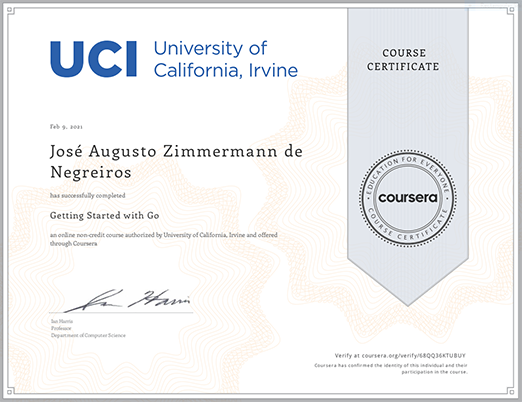

# X-Team Go Bootcamp

https://www.linkedin.com/in/juliano-silva-de-souza/

https://github.com/julianosouza/go-crash-course

---

# Coursera - Programming with Google Go Specialization
https://www.coursera.org/specializations/google-golang

### Part 1 - Getting Started with Go
https://www.coursera.org/learn/golang-getting-started

Certificate: https://coursera.org/share/105409475157221238470ce702ab7148

* Module 1: Getting Started with Go

* Module 2: Basic Data Types

https://github.com/gugazimmermann/xteam-bootcamp-go/tree/coursera-module-2-activity-findian-go

https://github.com/gugazimmermann/xteam-bootcamp-go/tree/coursera-module-2-activity-trunc-go

* Module 3: Composite Data Types

https://github.com/gugazimmermann/xteam-bootcamp-go/tree/coursera-module-3-activity-slice

* Module 4: Protocols and Formats

https://github.com/gugazimmermann/xteam-bootcamp-go/tree/coursera-module-4-activity-makejson.go

https://github.com/gugazimmermann/xteam-bootcamp-go/tree/coursera-final-course-activity-read.go

### Part 2 - Functions, Methods, and Interfaces in Go
https://www.coursera.org/learn/golang-functions-methods

* Module 1: Functions and Organization

https://github.com/gugazimmermann/xteam-bootcamp-go/tree/coursera-part-2-module-1-activity-bubble-sort-program

* Module 2: Function Types

https://github.com/gugazimmermann/xteam-bootcamp-go/tree/coursera-part-2-module-2-activity-linear-kinematics

* Module 3: Object Orientation in Go

https://github.com/gugazimmermann/xteam-bootcamp-go/tree/coursera-part-2-module-3-activity-objects

* Module 4: Interfaces for abstraction

### Part 3 - Concurrency in Go
https://www.coursera.org/learn/golang-concurrency

* Module 1: Why Use Concurrency?

* Module 2: Concurrency Basics

* Module 3: Threads in Go

* Module 4: Syncronized Communication

---
#### Resources

- https://github.com/dariubs/GoBooks#starter-books
- https://peter.bourgon.org/go-for-industrial-programming/
- https://dave.cheney.net/practical-go
- https://dave.cheney.net/high-performance-go
- https://medium.com/golangspec/interfaces-in-go-part-iii-61f5e7c52fb5
- https://golang.org/doc/effective_go.html
- https://towardsdatascience.com/use-environment-variable-in-your-next-golang-project-39e17c3aaa66
- https://gist.github.com/ghiden/0ff00fe355a24e790512
- https://github.com/golang-standards/project-layout
- https://github.com/golang/go/wiki/CodeReviewComments
